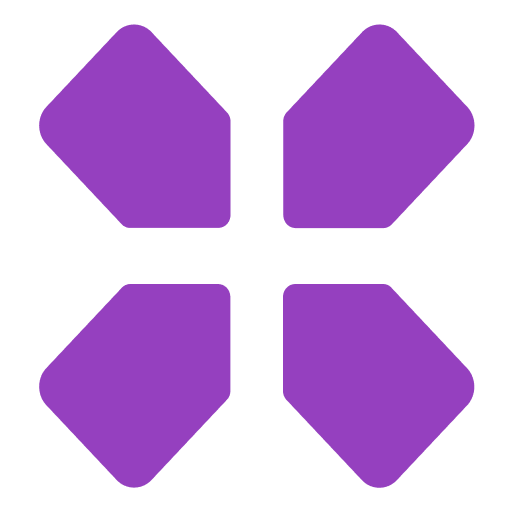
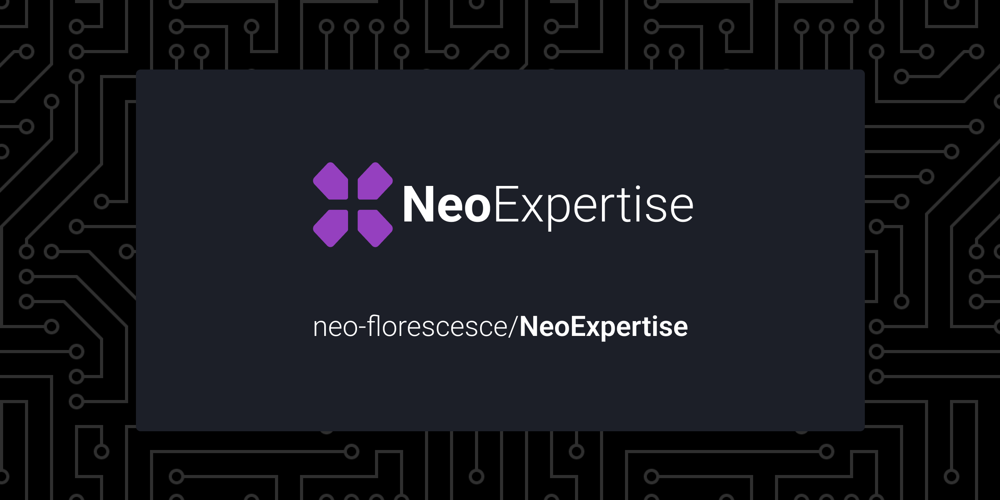
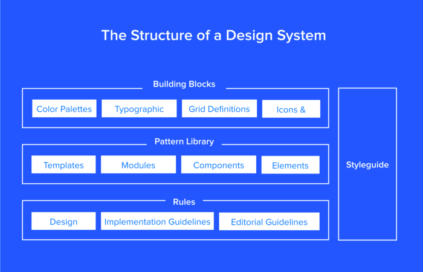

&nbsp;

<a href="https://github.com/neo-florescence/NeoExpertise">
  <div align="center">
    
    
  </div>
</a>


<div align="center">
  
  

  <a href="https://github.com/neo-florescence/NeoExpertise/blob/master/LICENSE.md">
    
  </a>

  <a href="https://github.com/neo-florescence/NeoExpertise/releases/latest">
    
  </a>
</div>

<br />



<h3 align="center">
  <a href="https://www.figma.com/file/FPDU6Ekw6eKzZlmiB6OhrB/Layout?node-id=315%3A77">Figma</a> &nbsp;&nbsp;|&nbsp;&nbsp;
  <a href="#">Notion</a>
</h3>

> NeoExpertise is a gaming e-commerce
> 

## Table of contents

- [Introduction](#introduction)
  - [What are we?](#what-are-we)
  - [Core Values](#core-values)
- [Development Environment](#development-environment)
  - [Tools](#tools)
    - [git](#git)
    - [github-cli (optional)](#github-cli)
    - [node](#node)
    - [yarn](#yarn)
    - [IDE/Code Editor](#ide)
- [Git Workflow](#git-workflow)
  - [branches](#branches)
  - [commits](#commits)
  - [releases](#releases)
  - [QA](#QA)
- [Architecture](#architecture)
  - [monorepo](#monorepo)
    - [microservices](#microservices)
    - [microfrontends](#microfrontends)
  - [technologies](#technologies)
  - [tests](#tests)
  - [accessibility](#accessibility)
- [Figma](#Figma)
  - [Style Guide](#Style-Guide)
  - [Design System](#Design-System)
  - [UI Kit](#UI-Kit)
- [Notion](#Notion)
- [Roadmap](#Roadmap)
  - Plugins Marketplace
  - Microservices?
  - Own packages?
- Challenges
- [License](#license)
- [Support](#support)
- You may also like
- [Contributors](#contributors)


<br />

<!--
  =====================================
  INTRODUCTION
  =====================================
-->
<section>
  <h1 id="introduction">
    <strong>
      📖 Introduction
    </strong>
  </h1>

  <div>
    <h2 id="what-are-we">
      What are we?
    </h2>
    <p>
      Neo Expertise is an e-commerce for gamers, bringing exclusive and personalized content that only exists here
    </p>
  </div>

  <br />
  <div>
    <h2 id="core-values">
      Core values
    </h2>
    <p>
      We aim to build a product that looks and feels good to use but projected for the gaming niche and having customization be it's biggest feature.
    </p>
  </div>
</section>


<br />
<br />

<!--
  =====================================
  DEVELOPMENT ENVIRONMENT
  =====================================
-->
<section>
  <h1 id="development-environment">
    <strong>
      Development Environment
    </strong>
  </h1>

  <p>Before diving into how to develop for Neo Expertise, we'll need some gear first, let's get that ready.</p>

  <br />

  <div>
    <h2 id="tools">
      Tools
    </h2>
    <strong>Here is a set of cherry-picked tools and why each is needed</strong>
    <ul>
      <li id="git">
        <h3>
          <a href="https://git-scm.com/"><strong>Git</strong></a>
        </h3>
        <p>you probably know this by now but git is pretty much essential when it comes to building software, you'll need it if you want to make any bigger contributions</p>
      </li>
      <li id="github-cli">
        <h3>
          <a href="https://cli.github.com/"><strong>Github CLI* (Optional)</strong></a>
        </h3>
        <p>github cli comes in handy when you need to create and merge multiple branches, in this project it plays a big role</p>
      </li>
      <li id="node">
        <h3>
          <a href="https://nodejs.org/en/"><strong>Node</strong></a>
        </h3>
        <p>Node.js is the biggest technology of all in the repo, because it allows us to run javascript outside of the browser, every library/package/app is build with node.js, you're contributing to any of those, you must install node.js</p>
        <p>as of the version, anything above 12.22.0 will work</p>
        <p>here is worth mentioning <a href="https://github.com/nvm-sh/nvm">NVM</a>, which makes it easy to have multiple node version in the same OS</p>
      </li>
      <li id="yarn">
        <h3>
          <a href="https://yarnpkg.com/"><strong>Yarn</strong></a>
        </h3>
        <p>
          Here at Neo Expertise we're using <a href="https://yarnpkg.com/">Yarn Berry (v3.1.1)</a> which is the more recent version of Yarn, Yarn berry gives us more flexibility on how to write software but also faster than <a href="https://www.npmjs.com/">npm</a>, yarn wrote a whole article on why and how you should <a href="https://yarnpkg.com/getting-started/migration">migrate</a>
          <ul>
            <li>Global caching of depencencies</li>
            <li><a href="#yarn-workspaces">Workspaces</a></li>
            <li>Offline cache</li>
            <li>Sharing Dependencies</li>
          </ul>
        </p>
        <p>
          All of these features play a HUGE role in how our software is written and also how it's shipped to the end user
          <blockquote><strong>As of now we don't make use of Yarn Berry's PnP, so any contribution that enables it will not be accepted</strong></blockquote>
        </p>
        <br />
        <p>
          <strong id="yarn-workspaces">Yarn Workspaces</strong><br />
          This is probably the feature that plays the biggest role of all in our monorepo, since Yarn Workspaces is the underlying system that makes all of this work. With yarn workspaces it's possible to share code & dependencies through multiple projects seamlessly, <a href="#architecture">here's a full explanation on why of that</a> 
        </p>
      </li>
      <li id="ide">
        <h3>
          <a href="https://yarnpkg.com/"><strong>IDE/Code Editor* (Optional)</strong></a>
        </h3>
        <p>
          as far as it goes you could use any code editor or IDE to contribute but if you're looking for some guidance we will recommend you some editors, why you would choose them and what plugins you should have installed to have the best experience while developing
          <ul>
            <li>
              <a href="https://code.visualstudio.com/">
                <strong>Visual Studio Code</strong>
              </a>
              <p>
                Visual Studio Code (not be mistaken by it's older purple brother, Visual Studio) is easily the most well known and "best" code editor available, our whole team at Neo-Florescence uses it, but we recommend you to use some plugins to enhance your coding experience.
              </p>
            </li>
            <li>
              <a href="https://www.lunarvim.org/#opinionated"><strong>LunarVim</strong></a>
              <p>
                LunarVim is an IDE built on top of the good ol' classic Neovim, looking very similar to Visual Studio Code but being as exensible as Neovim gets
              </p>
            </li>
            <li>
              <a href="https://www.gnu.org/software/emacs/"><strong>Emacs</strong></a>
              <p>
                Emacs is a text editor that is kind of similar to vim, being very customizable and fast
              </p>
            </li>
          </ul>
          <p>
            Here's a list of plugins you might find useful to have in your Code Editor/IDE
            <ul>
              <li>EditorConfig</li>
              <li>Eslint</li>
              <li>Prettier</li>
            </ul>
          </p>
        </p>
      </li>
    </ul>
  </div>
</section>


<br />
<br />

<!--
  =====================================
  GIT WORKFLOW
  =====================================
-->
<section>
  <h1 id="git-workflow">
    <strong>Git Workflow</strong>
  </h1>
</section>

Before contributing to NeoExpertise it's important for you to understand how we like to manage and create stuff in here

<section>
  <h2 id="branches">Branches</h2>
</section>

> This is a guide of how to manage your branches when contributing to NeoExpertise
> This guide applies to any kind of contribution, be it a bug fix, feature, typo and etc, this highly increases the codebase security and and reduces incomplete or not tested features to get to the final codebase

- **Create an Issue** <br />
  First, create an issue describing the changes you want to make to codebase, in the issue specify which service you want to change, why, what you're planning in doing, if our team flags your issue as valid, you can continue on, otherwise, close the issue.

- **Create a new Branch** <br />
  After your branch is flagged with the tag 'valid' you're free to create a branch to solve the problem you're trying to solve, for this you can use <kbd>git</kbd> CLI.

  ```bash
    git branch <BranchName> # Creates the branch
    git checkout <BranchName> # Go to the selected branch
    # ====
    #  OR
    # ====
    git checkout -b <BranchName> # Creates and Goes to the branch
  ```

  Now just copy and paste those commands into your terminal and chage the branch name to the name you would like to give to your branch
  <br />

  > <sup><sub>Note that the '<' and '>' should not be in the final script</sub>

  <section>
    <h2 id="commits">
      Commits
    </h2>
  </section>

After you've created your [branch](#branches) you need to actually change stuff in it so we can verify and merge it to the `main` branch

A commit is a piece of changed information, may it be code, text, or anything else, those commits, contain a type, a scope and a description like so:

`feat(website): add home landing page`

It's important that everytime you make a change or fix a bug or add a new feature you commit that, so we have a more organized git timeline

Our teams has already setup a set of tools to help you create better commits, those tools include:

- husky - fires commands before a commit is creates
- lint-staged - run linting tools on the files you've changed
- jest - run tests to ensure everything is working

Don't worry about how to use all of them, they will run automatically after you run

```bash
git commit
```

If some annyoing text editor keeps opening for you, please use:

```bash
git commit --no-edit
```

Using the `--no-edit` flag on the commit script will prevent git from making any changes to your commit

<br />
<br />

<section>
  <h2 id="releases">
      Releases
  </h2>
</section>

we still don't have a release system in place, so our team will launch new releases of the app whenever there is a new feature or a major bug fix


<br />
<br />

<section>
  <h2 id="QA">
      QA - Quality Assurance
  </h2>
</section>

here at NeoExpertise we build some guidelines regarding the QA process and how you should test our prototypes, today the prototypes are located [in here](https://www.figma.com/file/OQxRg1s4Gf2XYVgt1WnzaA/Neo-Expertise---Wireframe%2FLayout-E-Outros?node-id=3636%3A969), you can test them using the guidelines given on notion, whenever you find a problem, you can create a [issue here on github](https://github.com/Neo-Florescence/NeoExpertise/issues)


<br />
<br />

<!--
  =====================================
  ARCHITECTURE
  =====================================
-->
<section>
  <h1 id="architecture">
    <strong>
      Architecture
    </strong>
  </h1>

  <p>
    After getting your <a href="#tools">tools</a> ready, let's dive into NeoExpertise's monorepo architecture and how things are planned before they're built
  </p>

  <br />

  <div>
    <h2 id="monorepo">
      Monorepo
    </h2>
    <p>
      So basically, we've adopted a monorepo architecture, where all of our codebase lives under a single repository and there they share code and dependencies.
    </p>
    <ul>
      <li id="microservices">
        <h3>
          <strong>Microservices</strong>
        </h3>
        <p>
          Microservices is the idea of splitting a monolith application into small parts and then put all of those services together under a BFF of Data layer to talk to the front-end, here at NeoExpertise we're still thinking of how to implement this in a way fits our needs and pockets, so still a Work In Progress.
        </p>
      </li>
      <li id="microfrontends">
        <h3>
          <strong>Microfrontends</strong>
        </h3>
        <p>
          Our team first discovered it at <a href="https://micro-frontends.org/">micro-frontends.org</a> and since we've been implementing it in a similar way, of course we can't afford to host 2/4 different apps for each and every occasion but we've recently created a pattern which really helped us develop faster and better. If you want to see the lead up to why we've chosen micro-frontends, there's a pretty long  changelog of everything that happened architecture-wise in NeoExpertise down <a href="#architecture-changelog">here</a>
        </p>
        <br />
        <p id="architecture-changelog">
          We've started with two repositories, one repository was the back-end and the other the front-end
          <table>
            <tr>
              <th>Codebase</th>
              <th>Description</th>
            </tr>
            <tr>
              <td>E-commerce</td>
              <td>NeoExpertise's back-end repository</td>
            </tr>
            <tr>
              <td>neo-expensive</td>
              <td>The front-end, initially build with pure HTML, CSS and Javascript</td>
            </tr>
          </table>
        </p>
        <br />
        <p>
          Right after that, things evolved a little bit on the front-end adding a <a href="#yarn-workspaces">Yarn Workspaces</a> monorepo and some basic "services"
          <table>
            <tr>
              <th>Codebase</th>
              <th>Description</th>
            </tr>
            <tr>
              <td>Lint</td>
              <td>All of the repository linting configuration (Eslint and Prettier)</td>
            </tr>
            <tr>
              <td>Desktop</td>
              <td>An Electron React App that served as our desktop app</td>
            </tr>
            <tr>
              <td>Next</td>
              <td>A Next.js App that would in the future be our official front-end</td>
            </tr>
            <tr>
              <td>Web</td>
              <td>Our plain and old web app with HTML, CSS and Javascript</td>
            </tr>
          </table>
        </p>
        <br />
        <p>
          After some months and some thinking about the direction we would like to go with this, we've changed out "services" to what would be the "final" version of NeoExpertise.
          <table>
            <tr>
              <th>Codebase</th>
              <th>Description</th>
            </tr>
            <tr>
              <td>Lint</td>
              <td>All of the repository linting configuration (Eslint and Prettier)</td>
            </tr>
            <tr>
              <td>Dashboard</td>
              <td>A Next.js App that would serve as our dashboard</td>
            </tr>
            <tr>
              <td>Web</td>
              <td>Our plain and old web app with HTML, CSS and Javascript</td>
            </tr>
          </table>
          We dropped the Electron App and Next.js app and stuck with HTML, CSS and Javascript for the final version.
        </p>
        <br />
        <p>
          Some time after the last codebase update, we ran out of time and couldn't build something we liked, there were many and many merge conflicts here and there, we couldn't works as a team beacuse of the architecture and that limited us to 1 person developing the whole front-end.
          <br />
          <br />
          So we decided to change, now we've fully adopted a micro-frontend architecture to finally develop as a team and ship updates faster to the end user, as of now, this is how our architecture stands.
          <br />
          <br />
          We've decided to split our services and apps into 3 categories
          <ul>
            <li id="libs">
              <strong>Libs</strong>
              <br />
              The libs folder contains all of the source that is used to build other packages and apps, such as, linting configuration, compilers configurations and etc
              <br />
              <br />
              <table>
                <tr>
                  <th>Folder</th>
                  <th>Description</th>
                </tr>
                <tr>
                  <td>Lint</td>
                  <td>All of the repository linting configuration (Eslint, Prettier and Stylelint)</td>
                </tr>
                <tr>
                  <td>Postcss</td>
                  <td>Our base PostCSS configuration that new sevices can use</td>
                </tr>
              </table>
              <br />
            </li>
            <li>
              <strong>Packages</strong>
              <br />
              Packages can either be building blocks of another packages or apps, these usually make use of some <a href="#libs">libs</a>.
              <br />
              <br />
              <table>
                <tr>
                  <th>Folder</th>
                  <th>Description</th>
                </tr>
                <tr>
                  <td>Global</td>
                  <td>Global css configuration but layer-agnostic, written with only SCSS and compiled down to pure CSS, so this can be used in any other web-related project</td>
                </tr>
                <tr>
                  <td>Icons</td>
                  <td>Our icon library, built with React with all cherry-picked icons from our <a href="https://www.figma.com/file/FPDU6Ekw6eKzZlmiB6OhrB/Layout?node-id=315%3A77">figma file</a></td>
                </tr>
                <tr>
                  <td>Colors</td>
                  <td>All of our color tokens served in a javascript object for full compatibility with any system</td>
                </tr>
                <tr>
                  <td>UI</td>
                  <td>Here lies the bigest package of all, containing all UI Elements, these are separated by group and built on demand by page</td>
                </tr>
              </table>
              <br />
            </li>
            <li>
              <strong>Apps</strong>
              <br />
              Apps are our apps, that's it, not much explaining to do here
              <br />
              <br />
              <table>
                <tr>
                  <th>Folder</th>
                  <th>Description</th>
                </tr>
                <tr>
                  <td>Web</td>
                  <td>A Next.js app</td>
                </tr>
                <tr>
                  <td>Desktop</td>
                  <td>A Electron React App</td>
                </tr>
                <tr>
                  <td>Mobile</td>
                  <td>An Expo React Native app</td>
                </tr>
              </table>
              <br />
            </li>
          </ul>
        </p>
      </li>
    </ul>
  </div>

  <div>
    <h2 id="technologies">
      Technologies
    </h2>
    <p>
      Here's a list of technologies that are fundamental to how NeoExpertise is developed and deployed
      <br />
      <br />
      <a href="https://yarnpkg.com">
        
      </a>
      <a href="https://yarnpkg.com">
        
      </a>
      <a href="https://www.w3.org/html">
        
      </a>
      <a href="https://sass-lang.com">
        
      </a>
      <a href="https://postcss.org/">
        
      </a>
      <a href="https://reactjs.org/">
        
      </a>
      <a href="https://nextjs.org/">
        
      </a>
      <a href="https://www.typescriptlang.org/">
        
      </a>
      <a href="https://github.com/features/actions">
        
      </a>
      <a href="https://eslint.org/">
        
      </a>
      <a href="https://eslint.org/">
        
      </a>
      <a href="https://prettier.io/">
        
      </a>
      <a href="https://prettier.io/">
        
      </a>
    </p>
  </div>

  <div>
    <h2 id="tests">
      Tests
    </h2>
    <p>
      Here at NeoExpertise it's very important to have setup in all of our services so we be sure things are working at anytime, so we have jest setup in the root of the repo but also in each and every foler. Fell free to add plugins to jest if you want to or add another testing library if you thing jest is problematic.
      <br />
      <br />
      <blockquote>Don't stress about code coverage, that metric is not important to us.</blockquote>
      <br />
      <br />
      Here's a step-by-step tutorial on how to test things:
      <br />
      <br />
      <ol>
        <li>
          Check if there's a jest.config.js in the root of the folder you're working on, if there isn't a jest config, create an issue and ask for our team to create one or just create it yourself
        </li>
        <li>
          Check if the thing you want to test isn't already tested, look in the <kbd>__tests__</kbd> folder of the project you're working on
        </li>
        <li>
          Make sure to copy other tests before building your own and change stuff in it to test what you want to test
        </li>
      </ol>
    </p>
  </div>

  <div>
    <h2 id="accessibility">
      Accessibility
    </h2>
    <p>
      Here at NeoExpertise we care a LOT, and I mean a LOT about accessibility, if you're building any UI elements/componentes, make sure that it's accessible by keyboard, hover effects work and etc
      <br />
      <br />
      To help us build UI elements we really like to use <a href="https://www.radix-ui.com/">radix</a> and <a href="https://headlessui.dev/">headlessUI</a>, these come by default with accessibility features and are WAI-ARIA compliant
    </p>
  </div>
</section>


<br />
<br />

<section>
  <h1 id="Figma">
    <strong>
      Figma
    </strong>
  </h1>

  <p>
    It's important for you to understand how our figma file works, since it there that we built all of our components and layouts.
  </p>

  <br />

  <div>
    <h2 id="Design-System">
      Design System
    </h2>
    <p>
      Our design system contains a whole set of tools, documentation and principles that together have the objective to complete the company's goal. It's composed of Style Guide, Sketch Library, Pattern Library and other building blocks. Here's and example of how it works
    </p>
    
    <blockquote>“Um sistema de design não é um projeto, é um produto que serve produtos”. Nathan Curtis</blockquote>
    <br />
    <p>
      Our design can be broken down in 3 parts:
    </p>
    <ul>
      <li>Atoms - Simple elements, such as colors and font tokens</li>
      <li>Molecules - Groups of combined elements and common resources, such as input fields, textareas, headers and etc.</li>
      <li>Organisms - Templates made of molecules and atoms such as entire web pages or just large sections</li>
    </ul>
  </div>

  <div>
    <h2 id="Style-Guide">
      Style Guide
    </h2>
    <p>
      It's a subclass in the design chain. A documentation that should describe the design and padronize the style between all components, so in the style guide there should be rules for how big would the fonts be, size of paddings and margins, colors, border radius and etc.
    </p>
  </div>

  <div>
    <h2 id="UI-Kit">
      UI Kit
    </h2>
    <p>
      The UI Kit should contain a relative small number of components that are shared between pages in the layout, they help the front-end engineer to faster develop pages in the same "logical" group
    </p>
  </div>
</section>


<br />
<br />

<section>
  <h1 id="Notion">
    <strong>
      Notion
    </strong>
  </h1>

  <div>
    <h2>Sprints</h2>
    <p>
      If you get into the NeoExpertise team, you will have you tasks listed at the sprints section of Notion<br />
      There we will assign you sprints that will have some tasks to be done, they have a starting and ending date.
    </p>
  </div>
</section>


<br />
<br />

<section>
  <h1 id="license">
    <strong>
      License
    </strong>
  </h1>

  <div>
    This project is licensed under the MIT License
    So feel free to do anything you want with it.<br />
    see the <a href="LICENSE">LICENSE</a> file for details.
  </div>
</section>


<br />
<br />

<section>
  <h1 id="support">
    <strong>
      Support
    </strong>
  </h1>

  <div>
    If you ever notice any major bug or loophole, or have experienced some problem in our platform, please create a issue here at github so all of our contributors get notificated. 
  </div>
</section>


<br />
<br />

<section>
  <h1 id="contributors">
    <strong>
      Contributors
    </strong>
  </h1>

  <div>
    <a href="https://github.com/VitorGouveia">@VitorGouveia</a>
    <a href="https://github.com/atomicfeast">@Thiago</a>
  </div>
</section>