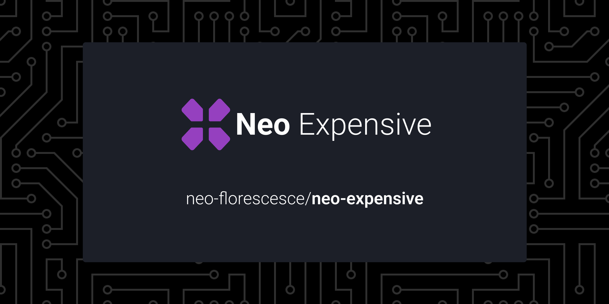

&nbsp;

<a href="https://github.com/neo-florescence/neo-expensive">
  

    
    
  

</a>

  
  

  

  

 

<h3 align="center">
  <a href="https://www.figma.com/file/FPDU6Ekw6eKzZlmiB6OhrB/Layout?node-id=315%3A77">Figma</a> &nbsp;&nbsp;|&nbsp;&nbsp;
  <a href="#">Notion</a>
</h3>

> Neo Expensive is a gaming e-commerce

## Table of contents

- [Introduction](#introduction)
  - [What are we?](#what-are-we)
  - [Core Values](#core-values)
- [Development Environment](#development-environment)
  - [Tools](#tools)
    - [git](#git)
    - [github-cli (optional)](#github-cli)
    - [node](#node)
    - [yarn](#yarn)
    - [IDE/Code Editor](#ide)
- Git Workflow
  - branches
  - commits
  - releases
  - QA
  - contributing
    - Getting Started
- Architecture
  - monorepo
  - tests
  - microservices
  - microfrontends
- Roadmap
- License
- Support
- You may also like
- Contributors

 

<!--
  =====================================
  INTRODUCTION
  =====================================
-->
<section>
  <h1 id="introduction">
    <strong>
      📖 Introduction
    </strong>
  </h1>

  

    <h2 id="what-are-we">
      What are we?
    </h2>
    

      Neo Expensive is an e-commerce for gamers, bringing exclusive and personalized content that only exists here
    

  

   
  

    <h2 id="core-values">
      Core values
    </h2>
    

      We aim to build a product that looks and feels good to use but projected for the gaming niche and having customization be it's biggest feature.
    

  

</section>

 
 

<!--
  =====================================
  DEVELOPMENT ENVIRONMENT
  =====================================
-->
<section>
  <h1 id="development-environment">
    <strong>
      Development Environment
    </strong>
  </h1>

  
Before diving into how to develop for Neo Expensive, we'll need some gear first, let's get that ready.

   

  

    <h2 id="tools">
      Tools
    </h2>
    <strong>Here is a set of cherry-picked tools and why each is needed</strong>
    <ul>
      <li id="git">
        <h3>
          <a href="https://git-scm.com/"><strong>Git</strong></a>
        </h3>
        
you probably know this by now but git is pretty much essential when it comes to building software, you'll need it if you want to make any bigger contributions

      </li>
      <li id="github-cli">
        <h3>
          <a href="https://cli.github.com/"><strong>Github CLI* (Optional)</strong></a>
        </h3>
        
github cli comes in handy when you need to create and merge multiple branches, in this project it plays a big role

      </li>
      <li id="node">
        <h3>
          <a href="https://nodejs.org/en/"><strong>Node</strong></a>
        </h3>
        
Node.js is the biggest technology of all in the repo, because it allows us to run javascript outside of the browser, every library/package/app is build with node.js, you're contributing to any of those, you must install node.js

        
as of the version, anything above 12.22.0 will work

        
here is worth mentioning <a href="https://github.com/nvm-sh/nvm">NVM</a>, which makes it easy to have multiple node version in the same OS

      </li>
      <li id="yarn">
        <h3>
          <a href="https://yarnpkg.com/"><strong>Yarn</strong></a>
        </h3>
        
As known for many of you, <a href="https://yarnpkg.com/">yarn</a> than <a href="https://www.npmjs.com/">npm</a>, which is the default node package manager, but we're not just using it for speed, yarn also has many other features that help make development faster and more enjoyable, like:
          <ul>
            <li>Global caching of depencencies</li>
            <li>Workspaces</li>
            <li>Offline cache</li>
          </ul>
        

        
Both of these features play a HUGE role in how our software is written and also how it's shipped to the end user

      </li>
      <li id="ide">
        <h3>
          <a href="https://yarnpkg.com/"><strong>IDE/Code Editor* (Optional)</strong></a>
        </h3>
        

          as far as it goes you could use any code editor or IDE to contribute but if you're looking for some guidance we will recommend you some editors, why you would choose them and what plugins you should have installed to have the best experience while developing
          <ul>
            <li>
              <a href="https://code.visualstudio.com/">
                <strong>Visual Studio Code</strong>
              </a>
              

                Visual Studio Code (not be mistaken by it's older purple brother, Visual Studio) is easily the most well known and "best" code editor available, our whole team at Neo-Florescence uses it, but we recommend you to use some plugins to enhance your coding experience.
              

            </li>
            <li>
              <a href="https://www.lunarvim.org/#opinionated"><strong>LunarVim</strong></a>
              

                LunarVim is an IDE built on top of the good ol' classic Neovim, looking very similar to Visual Studio Code but being as exensible as Neovim gets
              

            </li>
            <li>
              <a href="https://www.gnu.org/software/emacs/"><strong>Emacs</strong></a>
              

                Emacs is a text editor that is kind of similar to vim, being very customizable and fast
              

            </li>
          </ul>
          

            Here's a list of plugins you might find useful to have in your Code Editor/IDE
            <ul>
              <li>EditorConfig</li>
              <li>Eslint</li>
              <li>Prettier</li>
            </ul>
          

        

      </li>
    </ul>
  

</section>

## Tecnologies

 

 
 
 

# What Are We?

Neo Expensive is about the building of a brazilian e-commerce project for school.  
We as team aim to make a product that looks good and feel good to use, having what and everything a e-commerce needs to be successful!
That includes a register and login system, aswell as a functioning grocery cart, support and institutional page with much more to yet show...

 

# Insight Info

<h2>
  <a href="https://esquemaflorescer.github.io/neo-expensive/packages/web/">Neo Expensive Official Page</a>
</h2>

<h3>
  <a href="https://lucid.app/lucidchart/invitations/accept/inv_ebc6cbe7-7c47-4d54-b51c-5c2f5d29ea1f">SiteMap</a>
</h3>
You'll have to login to see this one.

<h3>
   <a href="https://www.figma.com/file/QyGjS7EPhR3LkcinvEafvM/Wireframe?node-id=0%3A1">Wireframe</a>
</h3>
<h3>
   <a href="https://www.figma.com/file/FPDU6Ekw6eKzZlmiB6OhrB/Layout?node-id=0%3A1">Layout</a>
</h3>

### Database Structure

### Folder Structure

| Codebase | Description |

| :----------------------------- | :--------------------: |
| [next](packages/next) | Main Web App |
| [web](packages/web) | HTML Prototype Web App |
| [server](packages/server) | The Node.js API |
| [workflows](.github/workflows) | Workflows |

 

# ⚖️ License

This project is licensed under the MIT License - see the [LICENSE](LICENSE) file for details.

 

# Code Reviewers

Contributors helping to review/merge pull requests:

- [@VitorGouveia](https://github.com/vitorgouveia)
- [@Thiago](https://github.com/atomicfeast)
